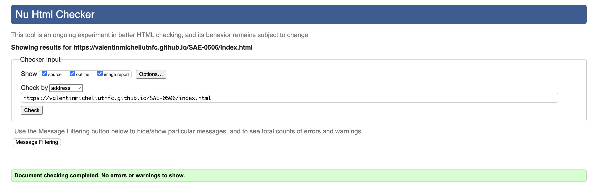
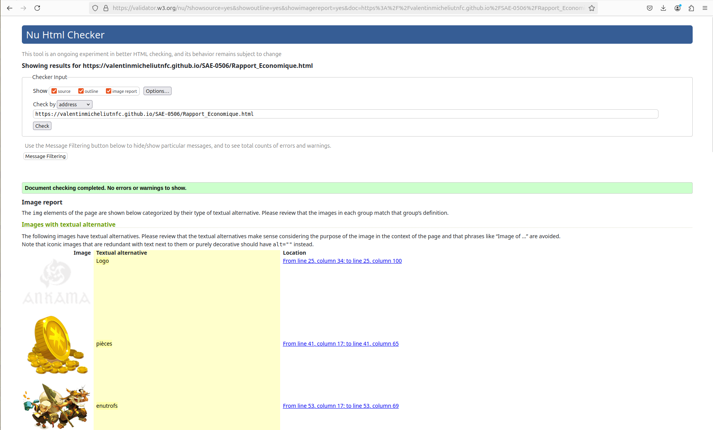
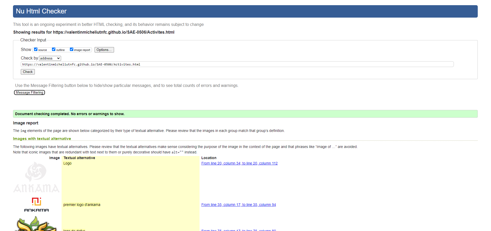
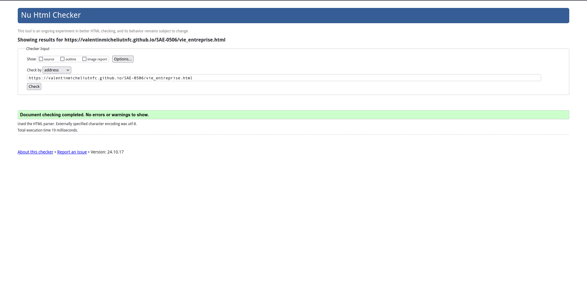
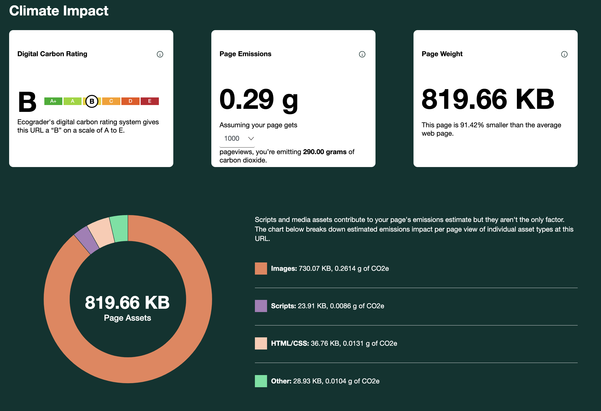
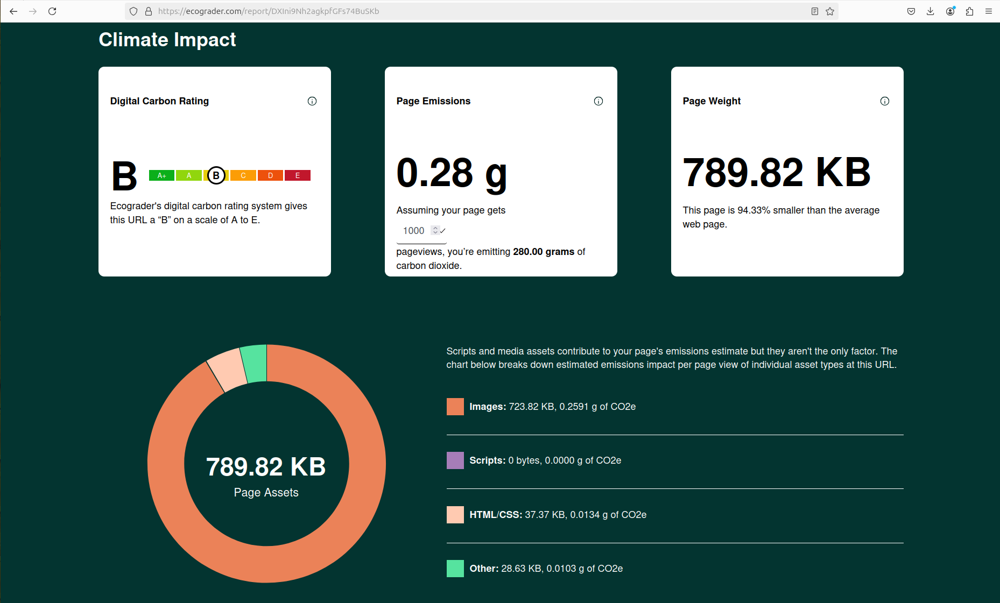
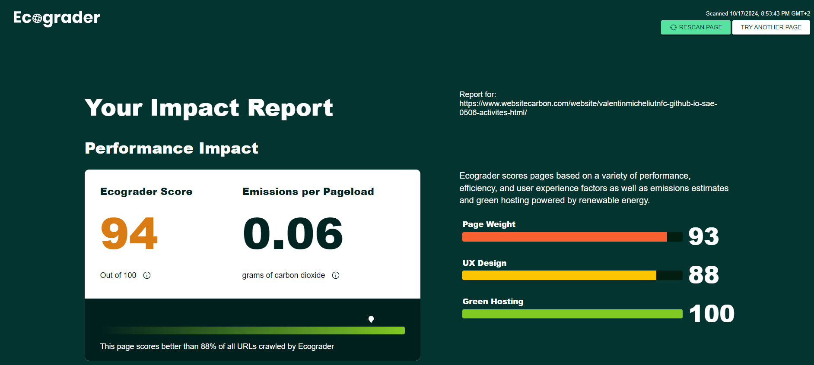
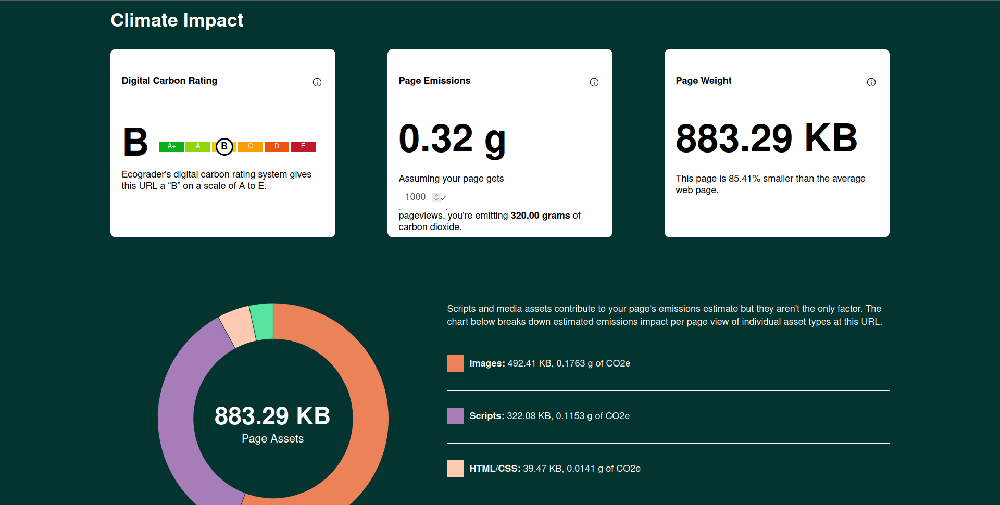

# SAE 0506  

## ANKAMA

[Accès site web](https://valentinmicheliutnfc.github.io/SAE-0506/)

## Membres du groupe :

Etudiant 1 (référent du groupe) :  [Thomas Millon](mailto:thomas.millon@edu.univ-fcomte.fr?subject=SAE_1_05_06)  
Etudiant 2 : [Valentin Michel](mailto:valentin.michel03@edu.univ-fcomte.fr?subject=SAE_1_05_06)   
Etudiant 3 : [Lïam Abid--Fontaine](mailto:liam.abid--fontaine@edu.univ-fcomte.fr?subject=SAE_1_05_06)  
Etudiant 4 : [Benjamin Jond](mailto:benjamin.jond@edu.univ-fcomte.fr?subject=SAE_1_05_06)  
Etudiant 5 : [Mathis Labbe](mailto:mathis.labbe@edu.univ-fcomte.fr?subject=SAE_1_05_06) 

# Présentation du projet

Le site se compose de 5 pages, incluant la page d'accueil, nous traitons dans une page de la vie de l'entreprise, de ses locaux. Une page traite de l'économie et une des activités et de l'histoire de l'entreprise. Enfin la dernière page traite de l'impact culturel de l'entreprise.

# Validation W3C

Accueil :
 

Rapport économique :
 

Activités/historique :
 

Impact culturel :
 

Vie de l'entreprise :
 
Lien : https://validator.w3.org/nu/?doc=https%3A%2F%2Fvalentinmicheliutnfc.github.io%2FSAE-0506%2Fvie_entreprise.html

# Validation CO2
Accueil :
 

Rapport économique :
 

Activités/historique :
 

Vie de l'entreprise :
 

